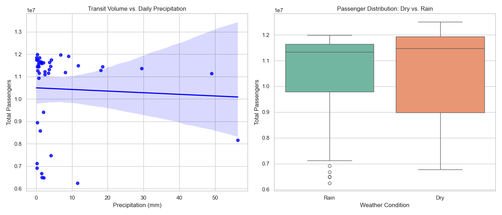
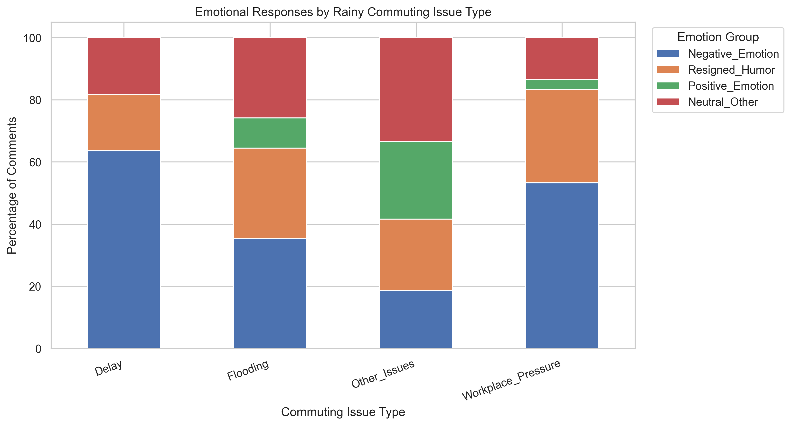

# Seoul Transit & Weather Analysis

**How do inclement weather conditions impact public transportation volume in Seoul, and how do commuters describe rainy travel experiences in online texts?**

Two branches of analysis on the same question. A quantitative branch joins daily ridership for Seoul's entire public transit network to historical weather and tests whether rain moves the numbers. A text branch collects Korean-language YouTube comments about rainy commutes, codes them with an LLM, and tests whether the kind of problem a commuter describes is associated with the emotion they express.

## Findings

Rain produced **no detectable difference in ridership**. Across 45 dry days and 42 rainy days from April to June 2026, a pooled independent t-test returned `t = -0.34, p = 0.73`. Levene's test was non-significant first (`1.559, p = .215`), so the equal-variance assumption held.



The figures show why: a flat regression slope against precipitation, and near-total overlap between the two distributions.

The commuter comments told a different story. Across 120 relevant comments, issue type and emotional response were significantly associated (`chi-square = 21.686, df = 9, p = 0.0099, Cramer's V = 0.245`), a small-to-moderate effect. **37.5% of expected cell counts fell below 5**, so that result is reported as exploratory rather than confirmatory.



Rain moved how commuters felt about the trip more clearly than how many of them took it.

## Pipeline

| Script | What it does |
|---|---|
| `01_data_extraction.py` | Pulls daily ridership from the Seoul Open Data API (paginated in 1,000-record batches) and daily precipitation and mean temperature from Open-Meteo, then joins them by date |
| `02_data_processing.py` | Fills missing precipitation, trims observations beyond 3 standard deviations, derives a binary rain/dry category |
| `03_text_analysis.py` | Searches YouTube for rainy-commute videos, filters candidates by keyword, collects comments, and codes each one with an LLM for relevance, issue type, emotion and intensity |
| `04_statistical_tests.py` | Levene's test and the independent t-test on ridership; chi-square and Cramer's V on issue type against emotion |
| `05_visualizations.py` | Scatter and boxplot for the transit branch, stacked bar and frequency charts for the text branch |

```
data/raw/         Transit_Weather_Raw.csv
data/processed/   Transit_Weather_Clean.csv, Rain_Commute_Clean.csv
outputs/          figures
```

## Data sources

| Source | Used for |
|---|---|
| [Seoul Open Data Plaza](http://openapi.seoul.go.kr) (`tpssPassengerCnt`) | Daily public transport passenger counts |
| [Open-Meteo Historical Weather API](https://open-meteo.com) | Daily precipitation and mean temperature |
| YouTube Data API v3 | Video search, metadata, and top-level comments |
| DeepSeek | Structured coding of comments |

## Setup

Requires Python 3.10+.

```bash
pip install requests pandas numpy scipy seaborn matplotlib openai
```

Create `scripts/config.py` with your API keys:

```python
SEOUL_OPEN_DATA_KEY = "your_seoul_open_data_key_here"
YOUTUBE_API_KEY = "your_youtube_api_key_here"
DEEPSEEK_API_KEY = "your_deepseek_api_key_here"
DEEPSEEK_MODEL = "deepseek-v4-flash"
```

`config.py` is gitignored and will not be tracked.

## Running

Run from the repository root, in order. Stages 2 through 5 read the intermediate CSVs, so each can be rerun independently once the data has been collected.

```bash
python scripts/01_data_extraction.py
python scripts/02_data_processing.py
python scripts/03_text_analysis.py      # long: one LLM call per comment, with checkpointing
python scripts/04_statistical_tests.py
python scripts/05_visualizations.py
```

## Method notes

The transit branch covers 87 days after outlier removal, split 45 dry and 42 rainy by whether precipitation exceeded 0 mm. Levene's test selects between the pooled and Welch t-tests rather than assuming equal variance.

The text branch collected 492 comments across nine videos, filtered to the 120 that an LLM judged both weather-relevant and commute-relevant. Each comment was coded against a fixed schema with enforced JSON output, a validator rejecting logically inconsistent labels, three-attempt retries, and periodic checkpointing.

Known limitations, as reported: YouTube selection bias, LLM labeling subjectivity, low expected frequencies in the chi-square, and no basis for causal interpretation.

## Contributors

A team project for Statistics in Python course at Sungkyunkwan University (SKKU).

| | Contribution |
|---|---|
| [James Corino](https://github.com/Jamescorino8) | Transit and weather branch: data acquisition, cleaning, t-test, figures |
| [Jiwoo Kim](https://github.com/kzzadukie) | Text-analysis branch: YouTube collection, LLM coding, chi-square, figures |